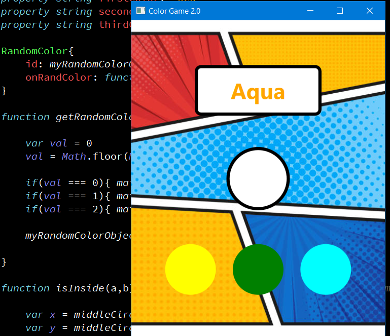

# Color-Game2.0
Remake of the Color-Game with improvements.

The rules are simple, drag the color specified by the word and avoid getting confused with the color of the text.

This project was made using a C++ class to generate a random color. The class "RandomColor" was registered into the QML side and implemented by creating "RandomColor" objects.
For the frontend I used QML and JS, both implemented in the main.qml file. The goal for this project was to remake the original Color-Game with improvements and better code and code readability.

